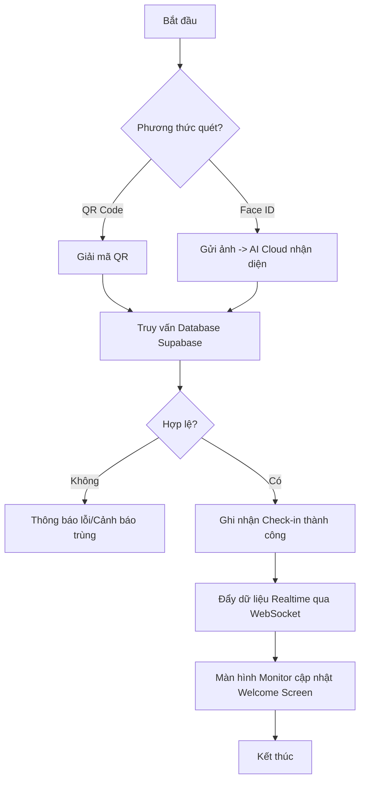
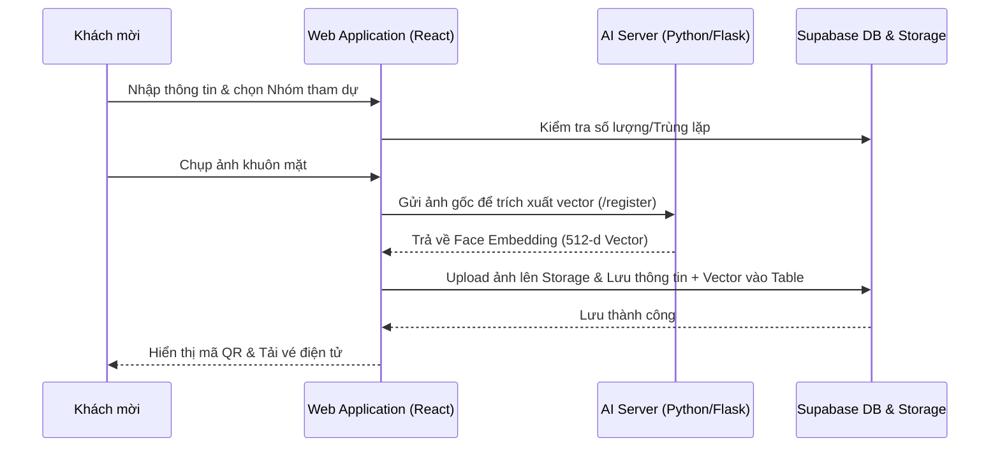
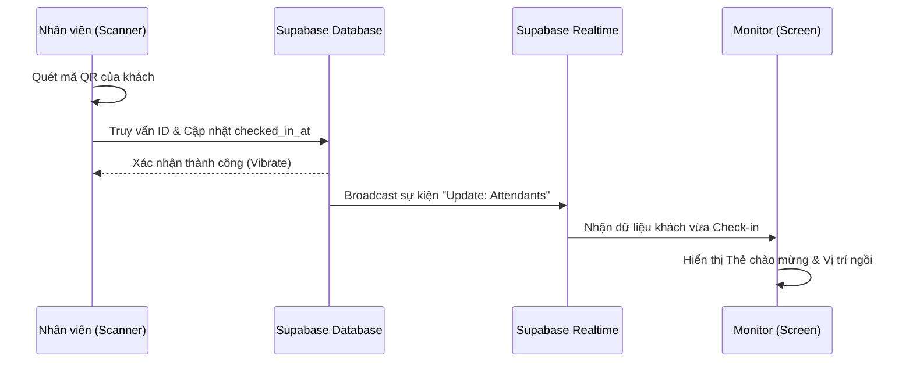
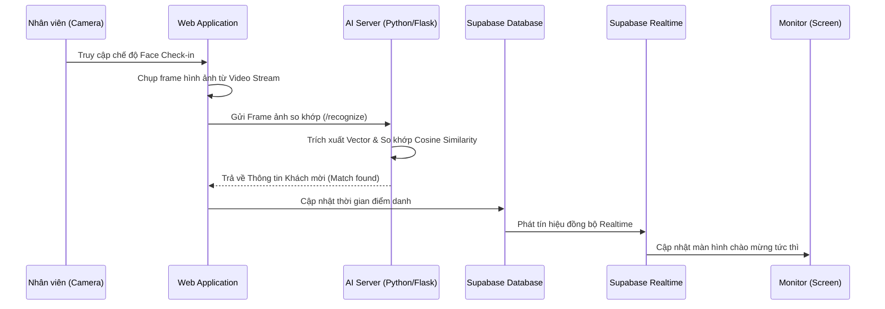

# BÁO CÁO DỰ ÁN: HỆ THỐNG ĐIỂM DANH SỰ KIỆN THỜI GIAN THỰC (EVENT CHECK-IN REALTIME)

---

## PHẦN HAI: MỞ ĐẦU

### 1. Đặt vấn đề
Trong bối cảnh chuyển đổi số mạnh mẽ, việc quản lý các sự kiện quy mô lớn đòi hỏi sự chuyên nghiệp và tốc độ xử lý dữ liệu tức thời. Hiện nay, nhiều đơn vị vẫn duy trì phương thức điểm danh truyền thống bằng danh sách giấy hoặc các file Excel rời rạc. Phương pháp này bộc lộ nhiều hạn chế:
- Tốc độ check-in chậm, gây ùn tắc tại cửa đón tiếp.
- Dễ xảy ra sai sót, nhầm lẫn thông tin khách mời.
- Khó khăn trong việc thống kê dữ liệu và báo cáo theo thời gian thực.
- Thiếu sự liên kết giữa các bộ phận quản trị và bộ phận điều hành tại hiện trường.

Chính vì vậy, yêu cầu xây dựng một hệ thống điểm danh thông minh, tích hợp mã QR và công nghệ nhận diện khuôn mặt (AI) là vô cùng cần thiết.

### 2. Ý nghĩa lý thuyết và thực tiễn
- **Ý nghĩa lý thuyết**:
    - Nghiên cứu và ứng dụng kiến trúc Serverless và Backend-as-a-Service (BaaS) với Supabase.
    - Tìm hiểu cơ chế trích xuất đặc trưng hình ảnh (Face Embedding) thông qua Deep Learning.
    - Áp dụng các phương thức truyền tải dữ liệu thời gian thực (Realtime Web).
- **Ý nghĩa thực tiễn**:
    - Số hóa hoàn toàn quy trình quản lý khách mời.
    - Giảm thiểu thời gian check-in, mang lại trải nghiệm chuyên nghiệp cho khách dự sự kiện.
    - Cung cấp số liệu thống kê chính xác, tức thì cho ban tổ chức.

### 3. Mục tiêu đề tài
- Xây dựng một Web Application ổn định, có khả năng mở rộng.
- Tích hợp quét mã QR Code với tốc độ phản hồi < 1 giây.
- Triển khai thành công tính năng nhận diện khuôn mặt bằng AI để tăng tính bảo mật và trải nghiệm.
- Đồng bộ dữ liệu lên màn hình chào mừng (Monitor) theo thời gian thực.

### 4. Phạm vi đề tài
- **Phần mềm**: Tập trung vào 2 thành phần chính: Frontend (React) và AI Backend (Python).
- **Thiết bị**: Hỗ trợ đa nền tảng (Mobile, Tablet, PC) thông qua trình duyệt web.
- **Giới hạn**: Hệ thống tập trung vào luồng điểm danh và quản lý sự kiện, chưa tích hợp sâu vào hệ thống quản lý tài chính.

### 5. Các phương pháp nghiên cứu
- **Phương pháp thực nghiệm**: Trực tiếp xây dựng và thử nghiệm các module chức năng.
- **Phương pháp tham chiếu**: Nghiên cứu các giải pháp check-in hiện có trên thị trường.
- **Phương pháp Agile**: Phát triển phần mềm theo từng giai đoạn, tối ưu hóa dựa trên phản hồi thực tế.

### 6. Kế hoạch thực hiện
| Giai đoạn | Nội dung công việc | Thời gian |
|-----------|--------------------|-----------|
| Giai đoạn 1 | Khảo sát yêu cầu, thiết kế cơ sở dữ liệu | 1 tuần |
| Giai đoạn 2 | Phát triển Frontend (Giao diện) và kết nối Supabase | 3 tuần |
| Giai đoạn 3 | Xây dựng AI Server nhận diện khuôn mặt | 2 tuần |
| Giai đoạn 4 | Kiểm thử, đóng gói Docker và triển khai (Deploy) | 1 tuần |

---


### CHƯƠNG 1: CƠ SỞ LÝ THUYẾT

#### 1.1 Giới thiệu ngôn ngữ lập trình JavaScript & TypeScript
- **JavaScript (JS)**: Là ngôn ngữ lập trình phổ biến nhất cho phát triển web, cho phép tạo ra các tính năng tương tác phức tạp trên trang web.
- **TypeScript (TS)**: Là bản nâng cấp của JavaScript, bổ sung thêm hệ thống kiểu dữ liệu tĩnh (static typing). TS giúp phát hiện lỗi sớm trong quá trình phát triển và làm cho mã nguồn dễ bảo trì hơn, đặc biệt là trong dự án lớn như hệ thống check-in này.

#### 1.2 Thư viện React và Nền tảng Supabase
- **React**: Một thư viện JavaScript mạnh mẽ để xây dựng giao diện người dùng theo hướng thành phần (Component-based). Giúp tối ưu hóa tốc độ render và tái sử dụng mã nguồn.
- **Supabase**: Là một nền tảng mã nguồn mở thay thế cho Firebase. Supabase cung cấp đầy đủ các thành phần Backend-as-a-Service (BaaS) như:
    - **PostgreSQL**: Cơ sở dữ liệu quan hệ mạnh mẽ.
    - **Realtime**: Đồng bộ dữ liệu qua WebSockets.
    - **Storage**: Lưu trữ tệp tin (ảnh đại diện, ảnh khuôn mặt).

#### 1.3 Mô hình AI và Flask (Python)
- **InsightFace**: Thư viện Python hàng đầu về nhận diện khuôn mặt, cung cấp các mô hình Deep Learning có độ chính xác cao để phát hiện và trích xuất vector khuôn mặt.
- **Flask**: Một framework web nhẹ dành cho Python, được sử dụng để xây dựng các API nhận diện khuôn mặt và tương tác với các ứng dụng khác.

#### 1.4 Giới thiệu Visual Studio Code (VS Code)
- VS Code là trình soạn thảo mã nguồn phổ biến nhất hiện nay, hỗ trợ nhiều extension quan trọng cho React và Python, giúp tăng hiệu suất lập trình viên.

#### 1.5 Giới thiệu về API, Web API và RESTful API
- **API**: Là cầu nối cho phép các phần mềm giao tiếp với nhau.
- **Web API**: Là API hoạt động trên môi trường web thông qua giao thức HTTP.
- **RESTful API**: Là một chuẩn thiết kế Web API tập trung vào tài nguyên (Resources), sử dụng các phương thức như GET, POST, PUT, DELETE để thực hiện các thao tác CRUD.

#### 1.6 Phân tích hệ thống hướng đối tượng và UML
- **UML (Unified Modeling Language)**: Là ngôn ngữ mô hình hóa thống nhất dùng để mô tả cấu trúc và hành vi của hệ thống. Các sơ đồ chính được sử dụng:
    - **Use Case Diagram**: Mô tả các tương tác của người dùng với hệ thống.
    - **Activity Diagram**: Mô tả luồng nghiệp vụ của hệ thống.
    - **Sequence Diagram**: Mô tả sự tương tác giữa các thành phần theo thời gian.

### CHƯƠNG 2: XÂY DỰNG CHƯƠNG TRÌNH

#### 2.1 Đặc tả hệ thống chi tiết

##### 2.1.1 Các nhóm người dùng (Actors)
Hệ thống xác định 4 nhóm đối tượng tương tác chính:
- **Quản trị viên (Super Admin)**: Có quyền cao nhất, quản lý toàn bộ sự kiện, cấu hình hệ thống, và xuất báo cáo tổng hợp.
- **Nhân viên sự kiện (Staff)**: Sử dụng các thiết bị di động/máy tính bảng để trực tiếp thực hiện check-in cho khách mời tại hiện trường.
- **Khách mời / Tình nguyện viên (Public Users)**: Đối tượng tham gia sự kiện, thực hiện đăng ký thông tin và dữ liệu khuôn mặt qua link chia sẻ.
- **Hệ thống hiển thị (Monitor)**: Là một actor thụ động, tự động cập nhật và hiển thị thông tin chào mừng khi có sự kiện check-in thành công.

##### 2.1.2 Yêu cầu chức năng (Functional Requirements)
Hệ thống phải đáp ứng các luồng nghiệp vụ sau:
- **Phân hệ Đăng ký (Public Registration)**:
    - Cung cấp link đăng ký công khai cho từng sự kiện.
    - Thu thập thông tin cá nhân (Họ tên, Email, SĐT, Đơn vị).
    - **Tích hợp khuôn mặt**: Cho phép khách mời chụp ảnh trực tiếp để trích xuất đặc trưng AI (Face Descriptor). Dữ liệu này được lưu trữ dưới dạng vector 512 chiều để phục vụ check-in ID sau này.
    - Phân phối mã QR cá nhân và chỉ dẫn khu vực/chỗ ngồi ngay sau khi thành công.
- **Phân hệ Quản trị**:
    - Thiết lập sự kiện (Tên, địa điểm, thời gian, ảnh nền riêng biệt).
    - Quản lý danh sách khách mời tập trung (CRUD, Import từ file Excel).
    - Tạo các Nhóm/Khu vực (Groups) để phân phối chỗ ngồi hoặc giới hạn số lượng đăng ký.
    - Xuất báo cáo điểm danh chi tiết sang định dạng Excel.
- **Phân hệ Điểm danh đa phương thức**:
    - **Check-in bằng QR Code**: Quét và giải mã mã định danh cá nhân.
    - **Check-in bằng Face ID**: Tự động nhận diện khuôn mặt và đối khớp với cơ sở dữ liệu AI với độ trễ thấp.
    - **Check-in thủ công**: Hỗ trợ tìm kiếm theo tên/SĐT trong trường hợp khách quên vé và không đăng ký ảnh.
- **Phân hệ Realtime Monitor**:
    - Tự động hiển thị thẻ chào mừng (Welcome Card) ngay khi có dữ liệu check-in mới mà không cần tải lại trang.
    - Phân biệt hiển thị giữa khách thường và khách VIP thông qua hiệu ứng giao diện.

##### 2.1.3 Yêu cầu phi chức năng (Non-functional Requirements)
- **Hiệu năng (Performance)**: Tốc độ nhận diện khuôn mặt và phản hồi check-in phải đạt mức < 2 giây trong điều kiện mạng ổn định.
- **Tính sẵn sàng (Availability)**: Sử dụng kiến trúc Cloud-native giúp hệ thống hoạt động 24/7, có khả năng chịu tải tốt khi lượng khách mời tăng đột biến.
- **Bảo mật (Security)**: 
    - Bảo vệ quyền riêng tư: Dữ liệu khuôn mặt được chuyển đổi thành vector số học (Face Embedding), không lưu trữ ảnh gốc nếu không cần thiết.
    - Phân quyền: Staff chỉ có quyền quét mã, không có quyền xóa dữ liệu sự kiện.

#### 2.2 Thiết kế Cơ sở dữ liệu (Database Schema)
Hệ thống sử dụng cơ sở dữ liệu PostgreSQL trên nền tảng Supabase với cấu trúc các bảng chính như sau:

- **Bảng `events`**: Lưu trữ thông tin chung về sự kiện.
    - `id` (UUID): Khóa chính.
    - `event_code`: Mã sự kiện duy nhất (dùng để tìm kiếm/đăng ký).
    - `name`, `location`, `description`: Thông tin chi tiết.
    - `image_url`: Link ảnh nền sự kiện.
- **Bảng `attendants`**: Lưu trữ danh sách khách mời và dữ liệu nhận dạng.
    - `id` (UUID): Khóa chính.
    - `event_id`: Liên kết với bảng `events`.
    - `full_name`, `email`, `phone`: Thông tin cá nhân.
    - `code`: Mã 6 chữ số định danh cá nhân (dùng cho QR).
    - `face_descriptor`: Mảng Vector (AI Embedding) dùng để so khớp khuôn mặt.
    - `is_vip` (Boolean): Đánh dấu khách ưu tiên.
    - `group_id`: Liên kết với bảng `event_groups`.
    - `checked_in_at`: Thời điểm khách check-in thành công.
- **Bảng `event_groups`**: Quản lý các nhóm/khu vực trong sự kiện.
    - `name`: Tên nhóm (Ví dụ: VIP, Báo chí, Sinh viên).
    - `limit_count`: Giới hạn số người đăng ký vào nhóm này.
    - `zone_label`: Chỉ dẫn chỗ ngồi/khu vực.
- **Bảng `checkin_logs`**: Nhật ký chi tiết của lịch sử điểm danh.
    - `attendant_id`, `event_id`: Liên kết dữ liệu.
    - `checked_in_at`: Thời gian ghi nhận.
- **Bảng `profiles`**: Quản lý tài khoản quản trị hệ thống.

#### 2.3 Phân tích thiết kế hệ thống (UML)

##### 2.3.1 Sơ đồ Use Case
```mermaid
useCaseDiagram
    actor Admin
    actor Staff
    actor Monitor
    actor Public

    Admin --> (Quản lý sự kiện)
    Admin --> (Import khách mời)
    Admin --> (Quản lý Nhóm/Vùng)
    Admin --> (Xem báo cáo & Thống kê)
    
    Staff --> (Quét QR Code)
    Staff --> (Check-in bằng Face ID)
    Staff --> (Tìm kiếm check-in thủ công)
    
    Monitor --> (Hiển thị trang chào mừng Realtime)
    
    Public --> (Đăng ký thông tin & Khuôn mặt)
    Public --> (Nhận mã QR định danh)
```

##### 2.3.2 Sơ đồ hoạt động (Luồng Check-in tổng quát)


##### 2.3.3 Sơ đồ tuần tự (Sequence Diagrams)

###### **a. Luồng Đăng ký & Gửi dữ liệu khuôn mặt (Public User)**


###### **b. Luồng Check-in bằng QR Code (Staff)**


###### **c. Luồng Check-in bằng Face ID (Staff)**


#### 2.4 Phát triển hệ thống và Giao diện

##### 2.4.1 Môi trường và Công nghệ triển khai
- **Frontend**: ReactJS + Vite được deploy trên Vercel.
- **Backend AI**: Web API viết bằng Flask (Python) triển khai trên Hugging Face Spaces.
- **Database**: Cloud PostgreSQL & Realtime Engine cung cấp bởi Supabase.

##### 2.4.2 Mô tả giao diện (UI/UX)
- **Dashboard Quản trị**: Sử dụng biểu đồ trực quan (Charts) để hiển thị tiến độ check-in theo thời gian thực.
- **Giao diện quét (Staff)**: Thiết kế tập trung vào tính tương tác cao, sử dụng các rung phản hồi (Vibrate) và âm thanh khi quét thành công hoặc gặp lỗi.
- **Welcome Screen (Monitor)**: Áp dụng ngôn ngữ thiết kế hiện đại, sử dụng các hiệu ứng chuyển cảnh mượt mà để tạo cảm giác trang trọng cho khách mời.

---

## PHẦN BỐN: KẾT LUẬN

### 1. Kết quả đạt được
- Xây dựng thành công hệ thống điểm danh đa phương thức hoàn chỉnh.
- Ứng dụng mô hình AI nhận diện khuôn mặt hoạt động ổn định trên môi trường Cloud Web.
- Đảm bảo tính realtime tuyệt đối khi đồng bộ dữ liệu giữa các máy trạm và màn hình hiển thị.
- Giao diện thân thiện, dễ sử dụng cho nhân viên và admin.

### 2. Hạn chế
- Độ chính xác của nhận diện khuôn mặt còn bị ảnh hưởng bởi điều kiện ánh sáng và chất lượng camera.
- Hệ thống phụ thuộc vào sự ổn định của kết nối Internet (chưa tối ưu hóa hoàn toàn chế độ Offline).
- Tài nguyên hosting miễn phí có giới hạn về băng thông và RAM khi tải các mô hình AI nặng.

### 3. Hướng phát triển
- Tối ưu hóa thuật toán nhận diện để hoạt động nhanh hơn trên thiết bị cấu hình thấp.
- Tích hợp tính năng gửi tin nhắn/email thông báo qua mã định danh cho khách mời.
- Phát triển module In thẻ/Vé tự động ngay khi khách check-in thành công.
- Xây dựng ứng dụng di động (Mobile App) chính thức để hỗ trợ quét QR ổn định hơn.
